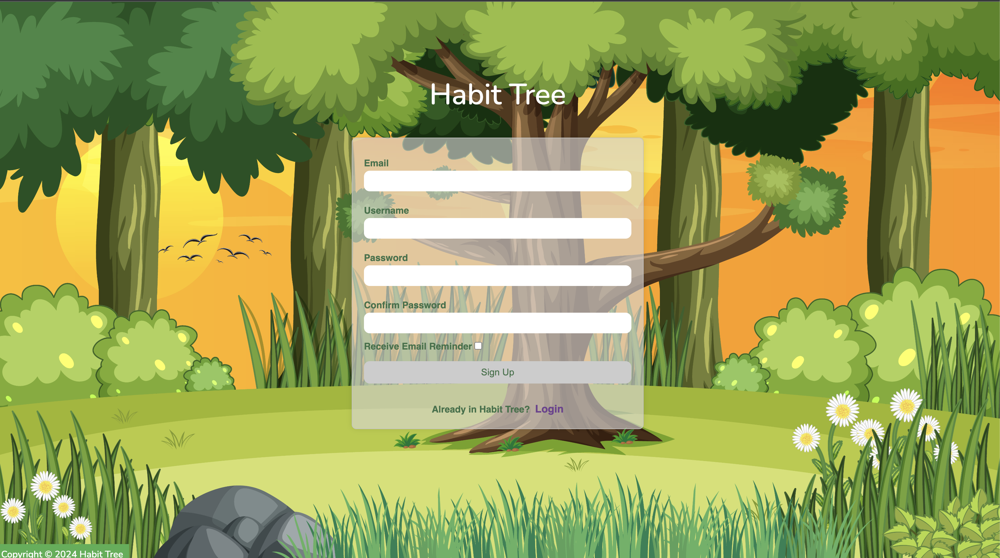
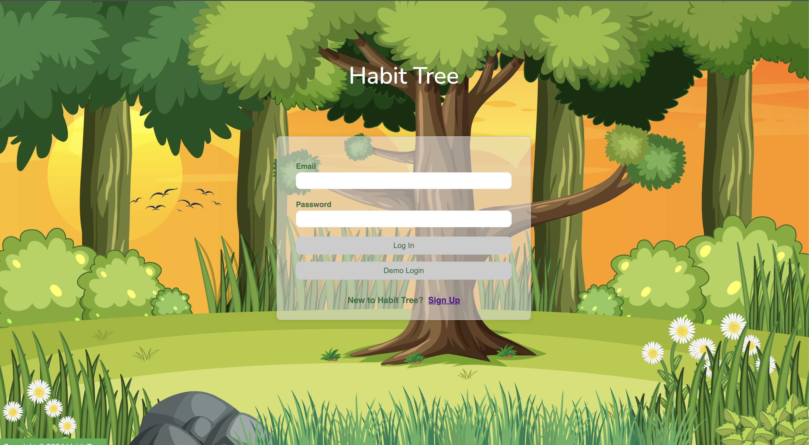
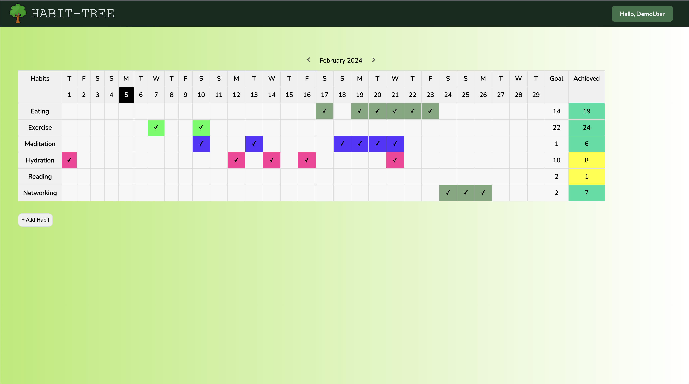
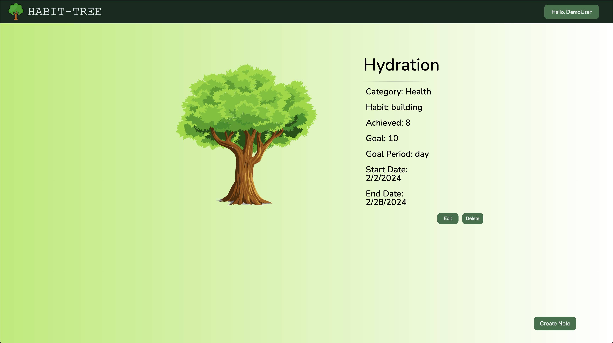
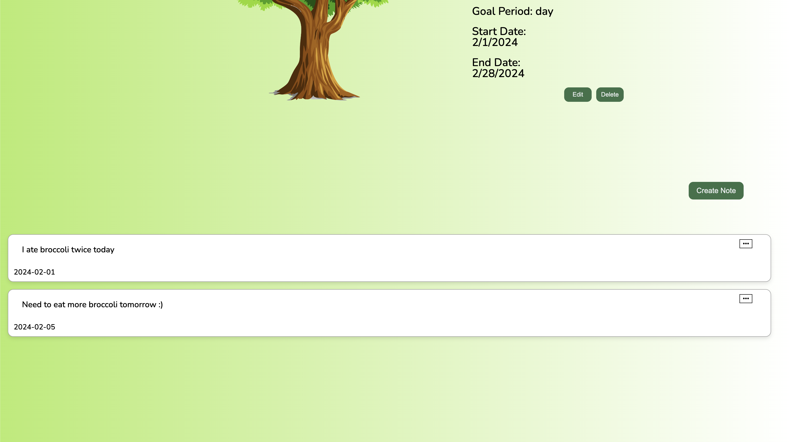
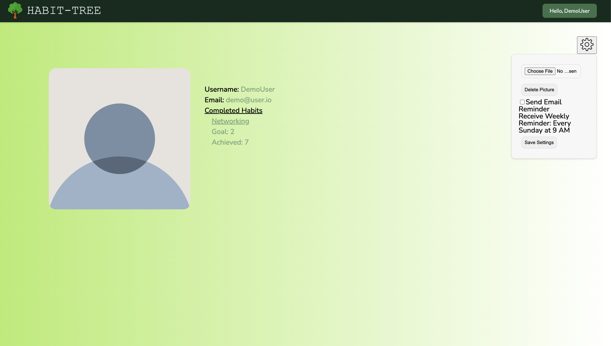

# Welcome To Habit Tree

Check out the [Live Site](https://habit-tree.onrender.com/)!

Habit Tree is a habit tracking web application designed to help users establish and maintain healthy habits. The app provides a user-friendly interface for tracking habits, adding notes, and visualizing progress with the growth of a virtual tree. To create a seamless user experience, we used technologies like:

* Languages: Javascript, HTML, and CSS
* Frontend: React/Node.js
* Backend: MongoDB, Express, and Nodemailer 
* Database: PostgreSQL
* Hosting: Render

## Features

### 1. User Authorization

- Users can create accounts and log in securely to create and maintain habits. A user must have an account and be logged in, in order to access personal habit info.




```javascript
const MainPage = () => {
  const [showSignUp, setShowSignUp] = useState(false);
  const [showLoginUp, setShowLogin] = useState(true);
  return (
    <div className="main">
      <div className="title">
        <h1>Habit Tree</h1>
      </div>

      {showLoginUp && (
        <AuthRoute
          component={LoginForm}
          setShowSignUp={setShowSignUp}
          setShowLogin={setShowLogin}
        />
      )}
      {showSignUp && (
        <AuthRoute
          component={signUpForm}
          setShowSignUp={setShowSignUp}
          setShowLogin={setShowLogin}
        />
      )}

      <footer className="footer">Copyright &copy; 2024 Habit Tree</footer>
    </div>
  );
};
```

### 2. Manage Habits
- Create and manage habits with ease. (CRUD)
- Users will be able to check and uncheck a select habit for a specific day.



```javascript
const CreateHabit = ({ editMode, habitToEdit, handleCloseModal }) => {
  const dispatch = useDispatch();
  const userId = useSelector((state) => state.session.user._id);

  const [habitData, setHabitData] = useState({
    user: userId,
    name: "",
    category: "",
    habitType: "building",
    achieved: 0,
    goal: 0,
    goalPeriod: "day",
    startDate: "",
    endDate: "",
    completed: false,
  });
  useEffect(() => {
    if (editMode && habitToEdit) {
      setHabitData(habitToEdit);
    }
  }, [editMode, habitToEdit]);

  const handleChange = (e) => {
    const { name, value } = e.target;
    setHabitData({
      ...habitData,
      [name]: value,
    });
  };

  const handleSubmit = (e) => {
    e.preventDefault();
    const formattedData = {
      ...habitData,
      startDate: new Date(habitData.startDate).toISOString(),
      endDate: new Date(habitData.endDate).toISOString(),
    };

    if (editMode) {
      dispatch(habitsAction.updateHabit(habitData._id, formattedData));
      handleCloseModal();
    } else {
      dispatch(habitsAction.createHabit(formattedData));
      dispatch(modalActions.hideModal());
    }
  };
  const handleKeyDown = (e) => {
    if (e.key === "Enter" && !e.shiftKey) {
      e.preventDefault();
      handleSubmit();
    }
  };

  const handleCloseBtn = () => {
    if (editMode) {
      handleCloseModal();
    }
    dispatch(modalActions.hideModal());
  };

  return (
    <Modal>
      <div className="habitModalWrapper">
        <button className="closeBtn" onClick={handleCloseBtn}>
          X
        </button>
        <div className="sharedBody">
          <form onSubmit={handleSubmit}>
            <div>
              <label>Name: *</label>
              <input
                type="text"
                name="name"
                value={habitData.name}
                onChange={handleChange}
                required
              />
            </div>
            <div>
              <label>Category: *</label>
              <input
                type="text"
                name="category"
                value={habitData.category}
                onChange={handleChange}
                required
              />
            </div>
            <div>
              <label>Habit Type: *</label>
              <select
                name="habitType"
                value={habitData.habitType}
                onChange={handleChange}
                required
              >
                <option value="building">Building</option>
                <option value="quitting">Quitting</option>
              </select>
            </div>
            <div>
              <label>Goal</label>
              <input
                type="number"
                name="goal"
                value={habitData.goal}
                onChange={handleChange}
              />
            </div>
            <div>
              <label>Goal Period:</label>
              <select
                name="goalPeriod"
                value={habitData.goalPeriod}
                onChange={handleChange}
              >
                <option value="day">Day</option>
                <option value="week">Week</option>
                <option value="month">Month</option>
              </select>
            </div>
            <div>
              <label>Start Date:</label>
              <input
                type="date"
                name="startDate"
                value={habitData.startDate}
                onChange={handleChange}
              />
            </div>
            <div>
              <label>End Date:</label>
              <input
                type="date"
                name="endDate"
                value={habitData.endDate}
                onChange={handleChange}
              />
            </div>
            <div className="checkBox">
              <label>Completed:</label>
              <input
                className="check"
                type="checkbox"
                name="completed"
                checked={habitData.completed}
                onChange={() =>
                  setHabitData({
                    ...habitData,
                    completed: !habitData.completed,
                  })
                }
              />
            </div>

            <button type="submit" onClick={handleKeyDown} className="submit">
              {editMode ? "Update Habit" : "Create Habit"}
            </button>
          </form>
        </div>
      </div>
    </Modal>
  );
};
```

- Users will be able to edit, update and delete the selected habit.



```javascript
const HabitIndexItem = () => {
  const navigate = useNavigate();
  const dispatch = useDispatch();
  const { habitId } = useParams();
  const habits = useSelector(selectAllHabitsArray);
  const habit = habits.find((habit) => habit._id === habitId);
  const [editMode, setEditMode] = useState(false);

  useEffect(() => {
    dispatch(fetchHabits());
  }, [dispatch, habitId]);

  const handleDelete = () => {
    dispatch(deleteHabit(habitId));
    navigate("/feed");
  };

  useEffect(() => {
    dispatch(fetchNotes(habitId));
  }, [dispatch, habitId]);

  const handleEdit = () => {
    setEditMode(true);
    dispatch(modalActions.showModal("SHOW_HABITS"));
  };

  const handleCloseModal = () => {
    setEditMode(false);
    dispatch(modalActions.hideModal());
  };

  if (!habit) {
    return <div>Habit not found</div>;
  }

  return (
    <div className="habit-container">
      <Tree progress={(habit.achieved / habit.goal) * 100} />
      <div className="habit">
        {editMode ? (
          <CreateHabit
            editMode={true}
            habitToEdit={habit}
            handleCloseModal={handleCloseModal}
          />
        ) : (
          <>
            <div className="allTheHabits">
              <h1>{habit.name}</h1>
              <ul className="habit-detail">
                Category: <li id="habitLi">{habit.category}</li>
              </ul>
              <ul className="habit-detail">
                Habit: <li id="habitLi">{habit.habitType}</li>
              </ul>
              <ul className="habit-detail">
                Achieved: <li id="habitLi">{habit.achieved}</li>
              </ul>
              <ul className="habit-detail">
                Goal: <li id="habitLi">{habit.goal}</li>
              </ul>
              <ul className="habit-detail">
                Goal Period: <li id="habitLi">{habit.goalPeriod}</li>
              </ul>
              <ul className="habit-detail">
                Start Date:{" "}
                <li id="habitLi">
                  {habit.startDate
                    ? new Date(habit.startDate).toLocaleDateString()
                    : "Not Specified"}
                </li>
              </ul>
              <ul className="habit-detail">
                End Date:{" "}
                <li id="habitLi">
                  {habit.endDate
                    ? new Date(habit.endDate).toLocaleDateString()
                    : "Not Specified"}
                </li>
              </ul>
              <ul className="habit-detail">
                {habit.completed ? (
                  <li id="completedLi">Compeleted &#10003;</li>
                ) : (
                  ""
                )}
              </ul>
            </div>
            <div className="buttonsDiv">
              <div className="editDiv">
                <button onClick={handleEdit} className="submitBtn">
                  Edit
                </button>
              </div>
              <div className="deleteDiv">
                <button onClick={handleDelete} className="submitBtn">
                  Delete
                </button>
              </div>
            </div>
          </>
        )}
      </div>
      <NoteIndex habitId={habitId} />
    </div>
  );
};
```

### 3. Notes
- Leave notes or comments upon checking in your habit to reflect on your progress and share insights. (CRUD)
- Users can create, edit, update, and delete a note thats attached to a specific habit. 



```javascript
const NoteIndexItem = ({ note, habitId }) => {
  const dispatch = useDispatch();
  const modalType = useSelector((state) => state.modals.type === "SHOW_NOTE");

  const handleDelete = (e) => {
    e.preventDefault();
    dispatch(deleteNote(habitId, note._id));
  };

  const handleClick = () => {
    dispatch(modalActions.showModal("SHOW_NOTE", note));
  };

  const createdAtString = note?.createdAt || "";
  const createdAt = new Date(createdAtString);
  const formattedDate = `${createdAt.getFullYear()}-${(createdAt.getMonth() + 1).toString().padStart(2, '0')}-${createdAt.getDate().toString().padStart(2, '0')}`;

  const [isDropdownVisible, setIsDropdownVisible] = useState(false);

  return (
    <>
      <div id="noteItem">
        <div id="note-header">
          <div id="noteDropdown"
            onMouseEnter={() => setIsDropdownVisible(true)}
            onMouseLeave={() => setIsDropdownVisible(false)}
          >
            <button id="noteDropdown-btn">&#8226;&#8226;&#8226;</button>
            {isDropdownVisible && (
              <div id="noteDropdown-content">
                <button id='noteBtn' onClick={handleClick}>Edit</button>
                <button id='noteBtn' onClick={handleDelete}>Delete</button>
                {modalType && <EditNote note={note} habitId={habitId} />}
              </div>
            )}
          </div>
        </div>
        <p id="noteContent">{note?.content || "No content"}</p>
        <p>{formattedDate}</p>
      </div>
    </>
  );
};
```

### 4. Email Reminders
- Users can go to their profile page and opt in to receive email reminders for their habits, enhancing engagement and consistency.
- Users can add a profile picture and check their goal counts and progress on this page.



```javascript
const ReminderButton = ({ userEmail }) => {
  const [reminderSent, setReminderSent] = useState(
    localStorage.getItem("reminderSent") === "true" ? true : false
  );

  useEffect(() => {
    localStorage.setItem("reminderSent", reminderSent);
  }, [reminderSent]);

  const sendReminderEmail = async () => {
    try {
      const res = await jwtFetch("/api/send-reminder", {
        method: "POST",
        body: JSON.stringify({ email: userEmail }),
        headers: {
          "Content-Type": "application/json",
        },
      });
      console.log("Reminder email sent:", res);
      setReminderSent(true);
    } catch (error) {
      console.error("Error sending reminder email:", error);
    }
  };

  const handleCheckboxChange = (event) => {
    const isChecked = event.target.checked;
    if (isChecked) {
      sendReminderEmail();
    } else {
      setReminderSent(false);
    }
  };

  return (
    <div className="emailReminder">
      <label>
        <input
          type="checkbox"
          checked={reminderSent}
          onChange={handleCheckboxChange}
          className="reminderCheckbox"
        />
        {reminderSent ? "Email Reminder Sent" : "Send Email Reminder"}
      </label>
    </div>
  );
};
```

### 6. Hosting on Render
- The app is hosted on Render for reliable and scalable hosting.

### 7. Production README
- Detailed instructions and information for running the app in a production environment.

## Feature Goals

### 1. Mood Tracker
- Users can track their mood upon checking in with their habit

### 2. GSAP(GreenSock Animation Platform) - Habit Growth Animation
- Enjoy a visually appealing experience as your habit tree grows with each completion.


## Timeline

**Days 1-2:**

- Frontend/Backend/Lead: Setting up user authentication.
- Frontend/Lead: Styling for MainPage & Navigation Bar.
- Lead/Frontend/Backend: Hosting.

**Days 3-4:**

- Frontend/Backend: Implementing habit features (CRUD).
- Lead: Assist/research documentation and libraries.

**Days 5-6:**

- Backend: Checking in feature.
- Lead: Styling/helping other roles.
- Frontend/Backend/Lead: Setting up GSAP habit growth animation.

## Group Members

Lead: **Yaqi Fang**

Frontend: **Farhat Sumaiya**

Backend: **Dominic Cashiola**